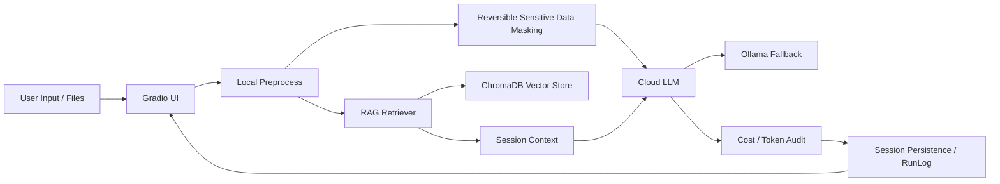

# Hush

隐私优先的个人 AI 工作流助手。项目围绕本地预处理、敏感信息脱敏、RAG 知识库注入、模型兜底和成本控制展开，目标是在保留 AI 能力的同时，把每一次调用变得可控、可审计、可追踪。

## Highlights

- 隐私优先：本地检测手机号、邮箱、身份证、API Key、密码、路径等敏感信息，脱敏后再进入模型调用链路。
- RAG 注入：支持把上传文档经 ChromaDB 向量检索后注入会话上下文，提升长文档问答的相关性。
- 模型兜底：云端 API 不可用时自动降级到 Ollama 本地模型，保持可用性。
- 成本控制：支持 token / 费用上限、实时余额展示和运行日志审计，避免调用失控。
- 工程闭环：支持多轮对话、流式输出、会话持久化、FastAPI 接口和 Docker 部署。

## What It Solves

很多个人 AI 工具的问题不在“能不能回答”，而在“能不能放心地用”。Hush 解决的是三个核心问题：

- 敏感内容不适合直接发往云端模型时，如何安全处理。
- 长文档和多轮上下文如何稳定接入 RAG。
- 云端 API 失效或成本过高时，如何仍然保持可用。

典型使用场景：

- 上传简历、合同、会议记录、工作文档并进行问答或总结。
- 对包含隐私信息的文本进行脱敏后再调用云端大模型。
- 在 API 异常或网络不稳定时自动切换到本地 Ollama 兜底。
- 追踪 token 消耗、费用和运行日志，控制个人 AI 使用成本。

## Architecture



## Tech Stack

| Layer | Tools |
| --- | --- |
| Agent / Workflow | LangChain |
| UI | Gradio |
| API | FastAPI + Uvicorn |
| Retrieval | ChromaDB + Ollama embeddings |
| Local Fallback | Ollama |
| Persistence | JSON session store |
| Automation | APScheduler, folder watcher |
| Deployment | Docker / Docker Compose |

## Quick Start

### Docker（推荐）

```bash
git clone https://github.com/xiaobai383/hush.git
cd hush
cp .env.example .env
# 编辑 .env，填入真实的 API Key
docker compose up -d
```

打开：`http://127.0.0.1:7860`

### 本地启动

```bash
git clone https://github.com/xiaobai383/hush.git
cd hush

python -m venv venv
source venv/bin/activate  # Windows: venv\Scripts\activate
pip install -r requirements.txt
cp .env.example .env

python app.py
```

### FastAPI 模式

```bash
python app.py --api
```

API 文档：`http://127.0.0.1:8000/docs`

## Environment Variables

```env
OPENAI_API_KEY=your_openai_api_key
DEEPSEEK_API_KEY=your_deepseek_api_key
OLLAMA_BASE_URL=http://localhost:11434
OLLAMA_MODEL=qwen2.5:7b
TOKEN_LIMIT=50000
ENABLE_REVERSIBLE_MASKING=true
ENABLE_COST_AUDIT=true
```

## Core Features

### 1. Sensitive Data Masking

Hush 会在调用模型前先检测并替换敏感信息，避免把原始隐私数据直接暴露给云端模型。返回结果后再根据本地映射进行还原。

### 2. RAG Knowledge Injection

上传文档后，系统会将内容切分、向量化并写入 ChromaDB，再把检索到的上下文注入多轮对话中，减少长文档回答失焦的问题。

### 3. Fallback Model Routing

主模型失败、超时或不可用时，系统会透明切换到 Ollama 本地模型。这样可以让对话在弱网和外部服务波动下继续工作。

### 4. Cost and Token Guard

系统会记录 token 消耗、费用估算和运行日志，并在超过预设阈值时熔断，避免单次请求过大导致成本失控。

### 5. Persistent Multi-Turn Workflow

支持多轮对话、流式输出和会话持久化，重启后历史记录仍然可用，更适合日常工作流而不是一次性 Demo。

## Project Structure

```text
├── app.py
├── config.yaml
├── Dockerfile
├── docker-compose.yml
├── setup.bat / setup.sh
├── src/
│   ├── agent/
│   ├── api/
│   ├── tools/
│   ├── workflow/
│   ├── knowledge/
│   ├── fallback/
│   ├── monitor/
│   ├── scheduler/
│   ├── ui/
│   └── config.py
├── workflows/
├── tests/
└── data/
```

## Roadmap

- 补充更完整的文档截图或演示 GIF。
- 增加 `.env.example` 与真实部署说明的一致性检查。
- 补充 RAG 与脱敏效果的基准测试案例。
- 补充更清晰的错误处理和降级策略说明。

## Why This Project Matters

Hush 展示的是一套完整的 AI 工程能力：不是只会调模型 API，而是能把隐私处理、RAG、会话管理、成本控制、API 接口和本地兜底组合成一个可长期使用的工作流系统。
